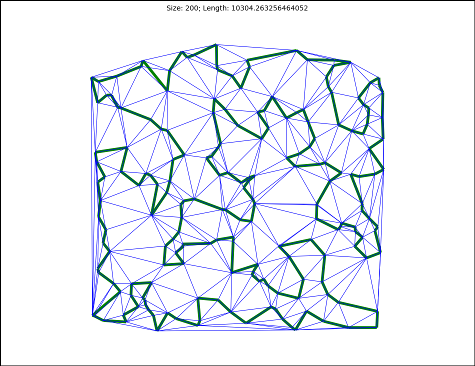
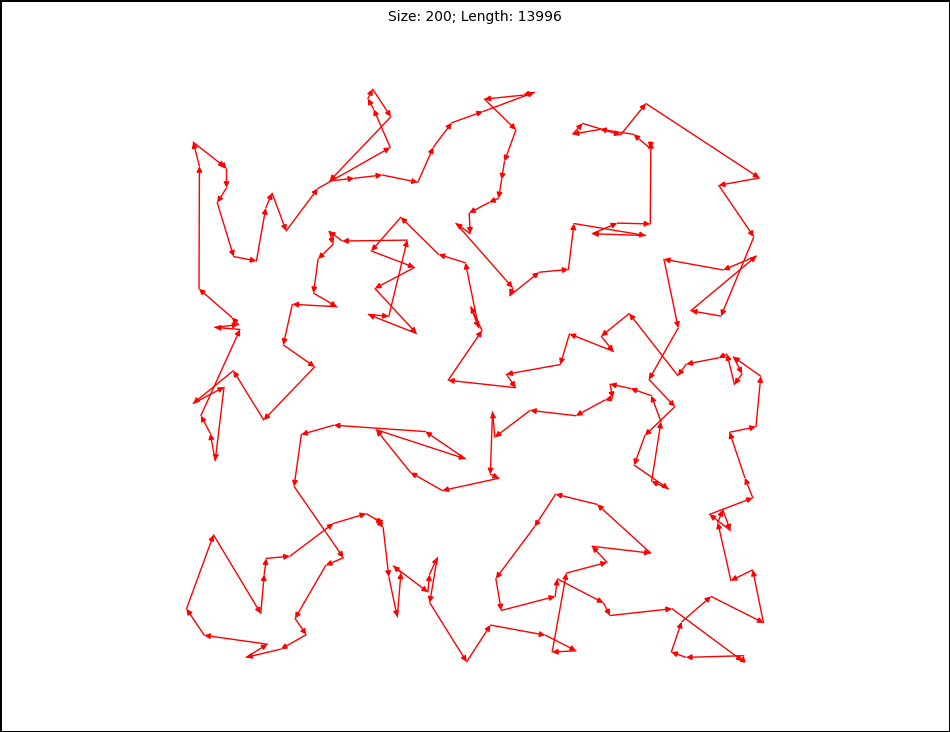

# TSP (Travelling Salesman Problem)
### Symmetric and Asymmetric Versions

Solving symmetric and asymmetric travelling salesman problems using integer linear programming.

### Symmetric Travelling Salesman Problem on the Euclidean Plane

### Asymmetric Travelling Salesman Problem

